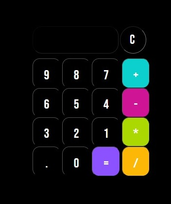

# 🔨 Projeto Simples de Calculadora em HTML, CSS e JS

Este é um projeto simples de calculadora desenvolvido utilizando HTML, CSS e JavaScript. O objetivo do projeto é criar uma calculadora básica que permita aos usuários realizar operações aritméticas simples.    
 

## 🛠️ Funcionalidades Implementadas

- Adição, subtração, multiplicação e divisão de números.
- Botão de limpar para reiniciar o cálculo.
- Exibição do resultado da operação na tela da calculadora.

## Como utilizar

1. Faça o download ou clone este repositório.
2. Abra o arquivo index.html em seu navegador web.
3. A calculadora será exibida na página.
4. Insira os números desejados clicando nos botões numéricos.
5. Utilize os botões de operação (+, -, *, /) para realizar as operações.
6. Clique no botão de igual (=) para exibir o resultado na tela.
7. Caso deseje reiniciar o cálculo, clique no botão de limpar (C).
 

## ✔️Técnicas e tecnologias utilizadas 

- ``HTML5`` Utilizado para a estruturação e marcação dos elementos da calculadora.
- ``CSS`` Utilizado para estilizar e posicionar os elementos da calculadora, proporcionando uma interface visual agradável.
- ``JavaScript`` Utilizado para implementar as funcionalidades da calculadora, realizar os cálculos e exibir os resultados.

## Próximas etapas de desenvolvimento

- Adicionar funcionalidade para operações matemáticas mais avançadas, como exponenciação e raiz quadrada.
- Melhorar a interface da calculadora, tornando-a responsiva para diferentes tamanhos de tela.
- Implementar validações para evitar operações inválidas ou erros de cálculo.

## Referências

- [W3Schools referência HTML](https://www.w3schools.com/tags/default.asp)
- [W3Schools referência CSS](https://www.w3schools.com/cssref/default.asp)
- [Google Fonts](https://fonts.googleapis.com/css2?family=Bebas+Neue&display=swap)
- [MDN lista de eventos](https://developer.mozilla.org/en-US/docs/Web/Events)

## Imagem - projeto pronto

 
Sinta-se à vontade para contribuir com melhorias, correções de bugs ou novas funcionalidades para este projeto simples de calculadora. 